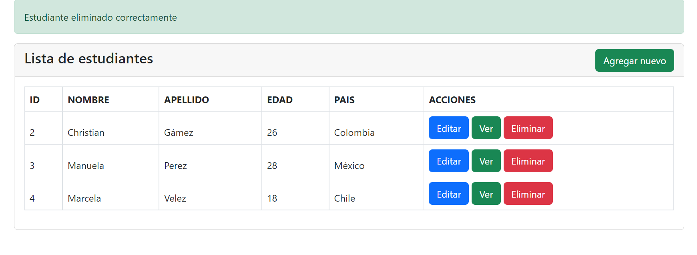
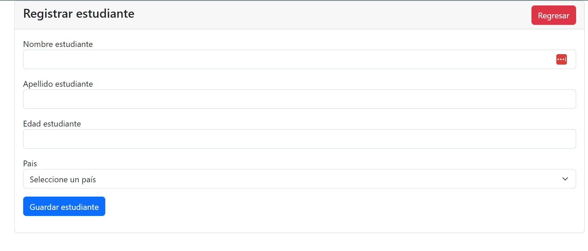
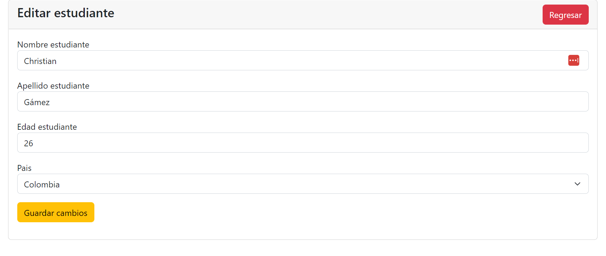

# crudphp-boopstrap

En este ejemplo vamos a crear un crud php mysql bootstrap utilizando xampp con php 8 y bootstrap 5, con la ayuda del editor de visual studio code. Vamos a crear mensajes personalizados de error para aprender todo los fundamentos.

